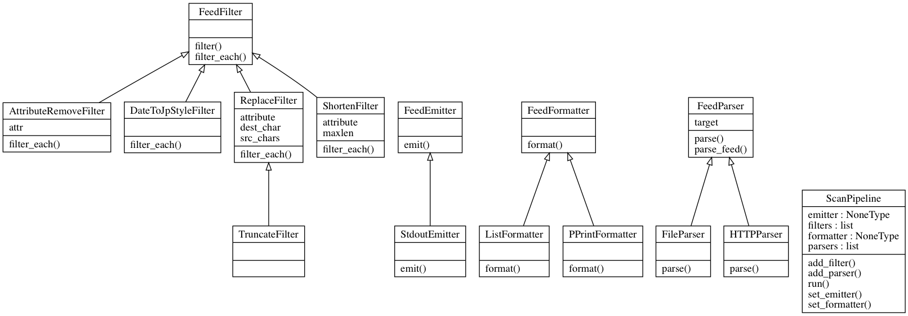

# rssscan

Everything goes well with RSS feeds.

## Install

```console
$ pip install rssscan
// Install only rssscan package because it requires no dependency packages
```

## Usage

### Basic

```console
$ rssscan http://tech.uzabase.com/rss
title: GaugeのConc...
description: <p>こんにちは！SPEEDA日本事業部でテストエンジニアを...
pubDate: Thu, 07 Jun 2018 12:04:32 +0900

title: モンスト、スマニュー...
description: <p>株式会社ユーザベースのSPEEDA Japan Com...
pubDate: Wed, 23 May 2018 17:31:05 +0900
...
```

### Multiple RSS

```console
$ rssscan http://tech.uzabase.com/rss https://qiita.com/msh5/feed.atom
title: GaugeのConc...
description: <p>こんにちは！SPEEDA日本事業部でテストエンジニアを...
pubDate: Thu, 07 Jun 2018 12:04:32 +0900

title: モンスト、スマニュー...
description: <p>株式会社ユーザベースのSPEEDA Japan Com...
pubDate: Wed, 23 May 2018 17:31:05 +0900
...

// following items are originated by second RSS
title: Python でも ...
description: <p><em>これまで依存パッケージ管理で遅れをとっていた ...
pubDate: 2018-06-15T12:26:28Z

title: Microsoft ...
description: <p><em>去る 6月4日、Microsoft による G...
pubDate: 2018-06-07T18:17:39Z
...
```

### Japanese Style "pubDate"

```console
$ rssscan --pubdate=jp http://tech.uzabase.com/rss
title: GaugeのConc...
description: <p>こんにちは！SPEEDA日本事業部でテストエンジニアを...
pubDate: 2018-06-07(Thu) 12:04:32

title: モンスト、スマニュー...
description: <p>株式会社ユーザベースのSPEEDA Japan Com...
pubDate: 2018-05-23(Wed) 17:31:05
...
```

### List Up with Title Only

```console  
$ rssscan --title-only share/sample.rss
GaugeのConc...
モンスト、スマニュー...
JaSST'18 T...
JaSST'18 T...
はじめてのDuct
...
```

## Class Diagram

